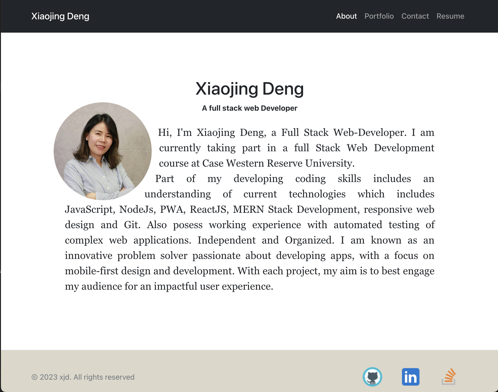

<h1>React Portfolio👋</h1>

## Description

🔍 This is my portfolio, created with React.js. It includes an About page, Portfolio page, Contact page, and Resume page. The Portfolio page showcases eight of my favorite applications. The Contact page allows you to send me a message. The Resume page features a link to download my resume and a list of my proficiencies. In the footer, you can find links to my GitHub, LinkedIn, and Stack Overflow profiles.

## Table of Contents

- [Description](#description)
- [Deployment](#application-deployment)
- [Screenshot](#application-screenshot)
- [Contributing](#contributing)
- [License](#license)
- [Questions](#questions)

## Application Deployment

[https://xiaojing-deng.herokuapp.com/](https://xiaojing-deng.herokuapp.com/)

## Application Screenshot

## Contributing

👥 Xiaojing Deng

## License

 

Permission to use this application is granted under the MIT license.

 
[MIT](https://choosealicense.com/licenses/mit)

## Questions

✋Reach me here: 
:octocat: Find me on GitHub: [xiaojing168jmg168](https://github.com/xiaojing168jmg168) 
📩 Email me with any questions: 8redfishcreative@gmail.com
